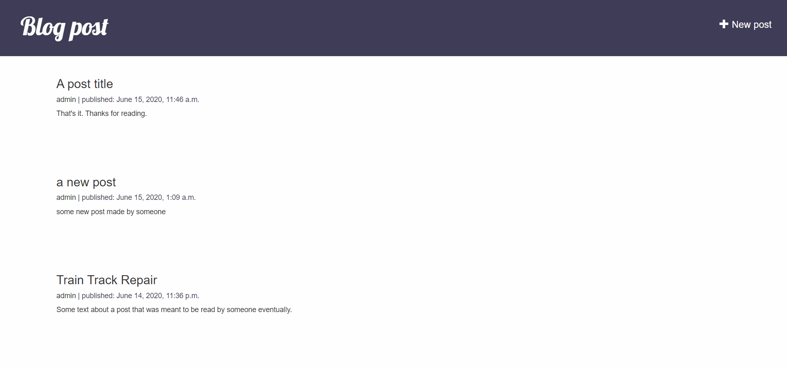

# Django-basic-blog

### Live demo link: (http://oussamabonnor.pythonanywhere.com/)

### Landing page screenshot:


## Getting Started

### Installing Dependencies

#### Python 3.7

Follow instructions to install the latest version of python for your platform in the [python docs](https://docs.python.org/3/using/unix.html#getting-and-installing-the-latest-version-of-python)

#### Installing Django

Follow instructions to install the lastest version of [Django](https://docs.djangoproject.com/en/2.2/intro/install/)
Or run this:

```
pip install -r requirements.txt
```

## Running the server

To run the server, execute:

```
python manage.py runserver
```
